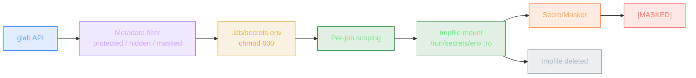

# CLAUDE.md

## Project Overview

Lab is a CLI tool to run GitLab CI/CD pipelines locally using Docker. It includes pipeline analysis, secrets management (via `glab`), and an MCP server for AI agent integration. Written in Rust (edition 2024).

## Common Commands

- `cargo build` — build the `lab` binary
- `cargo test` — run all tests (187 tests across 4 test suites)
- `cargo test -p lab-core` — run core library tests only
- `cargo test -p lab-core --test keywords` — run keyword integration tests
- `cargo test -p lab-core --test spec_examples` — run spec-derived tests
- `cargo clippy` — run linter
- `cargo fmt` — format code

## Architecture

### Crate Structure

```
crates/
├── lab-core/          # Library (thiserror for errors)
│   └── src/
│       ├── analyze.rs     # 15+ DevOps best practice rules
│       ├── artifacts.rs   # Artifact collection/injection
│       ├── cache.rs       # Key-based local caching
│       ├── config.rs      # Runtime config + .lab.yml
│       ├── secrets.rs     # SecretMasker + glab integration + pre-commit hooks
│       ├── model/         # GitLab CI YAML model types
│       ├── parser/        # YAML parsing + include/extends/!reference
│       ├── planner/       # DAG builder (topological sort)
│       ├── runner/        # Executor pattern + job execution
│       └── docker/        # Bollard Docker API wrapper
└── lab-cli/           # Binary (anyhow for errors)
    └── src/
        ├── main.rs        # CLI entry point
        ├── cli.rs         # Clap argument definitions
        ├── display.rs     # Colored output + preflight + analysis reports
        ├── logging.rs     # Tracing setup
        └── mcp.rs         # MCP server (12 tools, JSON-RPC over stdio)
```

### Execution Flow

1. **CLI** (`cli.rs`) — Clap parses flags, loads `.lab.yml`, loads secrets
2. **Parser** (`parser/`) — loads `.gitlab-ci.yml`, resolves includes/extends/!reference/merge keys
3. **Variables** (`model/variables.rs`) — builds predefined CI_* vars, expands `$VAR`/`${VAR}`
4. **Rules** (`model/rules.rs`) — evaluates workflow:rules and job rules (if/changes/exists)
5. **Planner** (`planner/dag.rs`) — topological sort from stages + needs, matrix expansion
6. **Preflight** (`display.rs`) — checks variable availability per job
7. **Runner** (`runner/runner.rs`) — converts Plan into composable Executor chains
8. **Script** (`runner/script.rs`) — creates containers, mounts secrets, runs scripts
9. **Docker** (`docker/`) — bollard wrapper for container lifecycle
10. **Report** (`display.rs`) — colored summary with durations and coverage

### Core Abstraction: Executor Pattern

The `Executor` type (`runner/executor.rs`) is a `Box<dyn FnOnce(ExecutorCtx) -> BoxFuture>`. Composable via:

- `pipeline()` — serial execution
- `parallel()` — concurrent with semaphore limit
- `then()`, `finally()` — chaining
- `when()` — conditional

### Security Architecture



### MCP Server

`mcp.rs` implements MCP over stdio (JSON-RPC 2.0). 12 tools:
`lab_analyze`, `lab_validate`, `lab_list`, `lab_dry_run`, `lab_secrets_check`, `lab_graph`, `lab_secrets_pull`, `lab_secrets_init`, `lab_explain_job`, `lab_suggest_fix`, `lab_run_job`, `lab_variable_expand`

### Key Modules

- `model/job.rs` — All GitLab CI job keywords with doc links
- `model/variables.rs` — Variable expansion, predefined CI_* vars, auto-detect pipeline source
- `model/rules.rs` — Recursive descent parser for rules:if expressions
- `parser/yaml.rs` — YAML merge keys, extends, !reference resolution
- `parser/resolver.rs` — include:local/remote/template/project resolution
- `planner/dag.rs` — Topological sort with cycle detection, matrix expansion
- `secrets.rs` — SecretMasker (base64 variants), glab integration, protected branch detection
- `analyze.rs` — 15 static analysis rules (security/performance/best practice)
- `docker/client.rs` — Container lifecycle with secret file mounting and output masking

## Testing

- 187 tests across 4 suites
- `crates/lab-core/src/` — 45 unit tests (inline `#[cfg(test)]`)
- `crates/lab-core/tests/keywords.rs` — 82 keyword integration tests
- `crates/lab-core/tests/spec_examples.rs` — 60 tests from official GitLab YAML spec
- Test fixtures in `tests/fixtures/` (7 sample pipelines)

## GitLab Documentation

- `docs/gitlab-ci-yaml-spec.md` — Official spec (fetched from gitlab.com)
- `docs/gitlab-ci-reference.md` — Keyword-by-keyword implementation status
