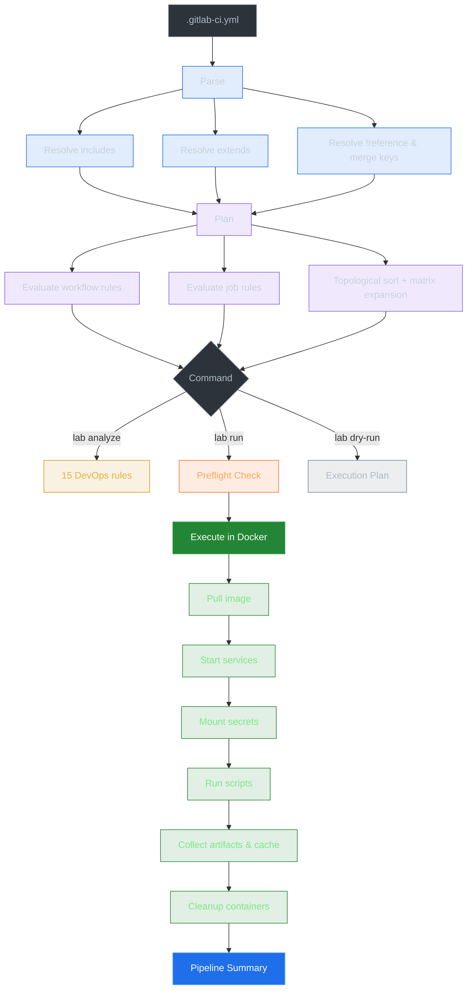

# lab

Run GitLab CI/CD pipelines locally using Docker.

`lab` parses your `.gitlab-ci.yml`, builds an execution plan, and runs each job in a Docker container — just like GitLab Runner, but on your machine. It includes built-in pipeline analysis, secrets management via `glab`, and an MCP server for AI agent integration.

## Installation

```bash
cargo install --path crates/lab-cli
```

Or build from source:

```bash
cargo build --release
# Binary at target/release/lab
```

## Quick Start

```bash
# Run the full pipeline
lab run

# Run a specific job
lab run test

# Run all jobs in a stage
lab run --stage build

# Analyze pipeline for issues
lab analyze

# List all jobs and stages
lab list

# Show execution plan without running
lab run --dry-run

# Debug a job interactively
lab shell test

# Pull secrets from GitLab
lab secrets pull
```

## Commands

| Command | Description |
|---------|-------------|
| `lab run [JOB]` | Run pipeline jobs in Docker containers |
| `lab analyze` | Analyze pipeline for security, performance, and best practices |
| `lab list` | List all jobs and stages |
| `lab validate` | Parse and validate `.gitlab-ci.yml` |
| `lab graph` | Show job dependency graph |
| `lab shell <JOB>` | Drop into interactive container for debugging |
| `lab secrets pull` | Pull secrets from GitLab via `glab` |
| `lab secrets check` | Check which secrets are available vs missing |
| `lab secrets init` | Generate secrets template for developers |
| `lab mcp-server` | Start MCP server for AI agent integration |
| `lab completions <SHELL>` | Generate shell completions (bash/zsh/fish) |

### `lab run` Options

```
lab run [OPTIONS] [JOB]

Arguments:
  [JOB]                          Specific job to run (runs all if omitted)

Options:
      --stage <STAGE>            Run all jobs in a specific stage
  -f, --file <FILE>              Path to .gitlab-ci.yml [default: .gitlab-ci.yml]
  -v, --var <KEY=VALUE>          Set CI/CD variable (can be repeated)
      --pull-policy <POLICY>     always | if-not-present | never [default: if-not-present]
      --privileged               Run containers in privileged mode (for dind)
      --no-artifacts             Disable artifact passing
      --no-cache                 Disable cache
      --no-secrets               Skip loading .lab/secrets.env
      --pull-secrets             Pull fresh secrets from GitLab before running
      --secrets <FILE>           Use custom secrets file
      --dry-run                  Show plan without running containers
      --no-preflight             Skip variable availability check
  -P, --platform <JOB=IMAGE>     Override image for a job
      --max-parallel <N>         Maximum parallel jobs
      --verbose                  Verbose output
```

## Pipeline Analysis

`lab analyze` checks your pipeline against 15+ rules covering security, performance, and best practices:

```bash
$ lab analyze

Pipeline Analysis found 5 issue(s): 0 critical, 3 warnings, 2 info

  WARNING  unpinned-image-tag [deploy]
           Image 'alpine:latest' uses :latest — builds are non-deterministic
           Fix: Pin to a specific version (e.g., alpine:3.19)

  WARNING  missing-cache [build]
           Job 'build' installs dependencies but has no cache
           Fix: Add cache: with key based on lockfile to speed up builds

  INFO     missing-interruptible [test]
           Job 'test' is not marked interruptible
           Fix: Add interruptible: true so it's canceled on new pushes
```

JSON output for automation: `lab analyze --output json`

### Analysis Rules

| Category | Rules |
|----------|-------|
| **Security** | `deploy-without-rules`, `hardcoded-secret`, `unpinned-image-tag`, `dind-without-tls`, `deploy-allow-failure` |
| **Performance** | `missing-cache`, `large-base-image`, `missing-interruptible`, `no-dag-needs`, `artifact-no-expiry` |
| **Best Practice** | `missing-workflow-rules`, `missing-timeout`, `missing-retry`, `missing-coverage`, `duplicate-script`, `manual-deploy-no-confirmation` |

## Secrets Management

`lab` integrates with `glab` to pull CI/CD variables from GitLab, respecting `protected`, `masked`, and `hidden` flags.

### For DevOps (full access)

```bash
# Authenticate with GitLab
glab auth login

# Pull all project + group variables
lab secrets pull
# ✓ 11 secret(s) saved to .lab/secrets.env
#   ⊛ 9 masked variable(s) — will be hidden in job output
#   ⊘ 2 protected variable(s) skipped — branch is not protected

# Run with secrets
lab run
```

### For Developers (limited access)

```bash
# Generate secrets template
lab secrets init
# Creates .lab/secrets.env.example (committed)
# Creates .lab/secrets.env (git-ignored)

# Fill in dev-safe values
cp .lab/secrets.env.example .lab/secrets.env

# Run jobs that don't need secrets
lab run quality
```

### Pre-flight Check

Before running, `lab` checks which jobs have missing variables:

```
Pre-flight variable check:

  ✓ quality — all variables available
  ✗ build-affected — 1 missing variable(s):
      · AWS_PROFILE_ECR_USER

1 job(s) may fail due to missing variables.
Options:
  1. Add missing values to .lab/secrets.env
  2. Run specific jobs: lab run quality
  3. Skip this check: lab run --no-preflight

Continue anyway? [y/N]
```

### Security Features

| Feature | Description |
|---------|-------------|
| **Output masking** | Secret values in job stdout/stderr replaced with `[MASKED]` |
| **Secrets via file mount** | Secrets mounted at `/run/secrets/env` instead of env vars (invisible to `docker inspect`) |
| **Per-job scoping** | Only secrets referenced by a job's scripts are injected |
| **Protected variables** | Skipped on non-protected branches (matching GitLab behavior) |
| **File permissions** | `.lab/secrets.env` created with `chmod 600` |
| **Pre-commit hook** | Auto-installed to block committing secrets |
| **Base64 masking** | Both raw and base64-encoded secret values are masked |
| **Image tag warnings** | Warns about `:latest` and non-deterministic image tags |

## AI Agent Integration (MCP)

`lab` includes a built-in [MCP](https://modelcontextprotocol.io/) server that exposes 12 tools for AI agents.

### Setup

Add to your Claude Code config (`~/.claude/settings.json`):

```json
{
  "mcpServers": {
    "lab": {
      "command": "lab",
      "args": ["mcp-server"]
    }
  }
}
```

### Available MCP Tools

| Tool | Description |
|------|-------------|
| `lab_analyze` | Analyze pipeline for security/performance/best practice issues |
| `lab_validate` | Validate .gitlab-ci.yml syntax and structure |
| `lab_list` | List all jobs, stages, images, and dependencies |
| `lab_dry_run` | Show execution plan without running containers |
| `lab_secrets_check` | Check secret availability vs requirements |
| `lab_secrets_pull` | Pull secrets from GitLab via glab |
| `lab_secrets_init` | Generate secrets template |
| `lab_graph` | Show job dependency graph |
| `lab_explain_job` | Get detailed explanation of a specific job |
| `lab_suggest_fix` | Get YAML fix for an analyze finding |
| `lab_run_job` | Run a specific job and return output |
| `lab_variable_expand` | Expand `$VAR` references and show resolved value |

### Example AI Interaction

```
User: "Analyze my pipeline and suggest improvements"

AI: [calls lab_analyze] → 5 findings
AI: "I found 3 warnings:
     1. build-affected is missing cache
     2. deploy images use :latest
     3. test job missing interruptible flag"

AI: [calls lab_suggest_fix for each]
AI: "Here are the fixes to apply:
     1. Add to build-affected:
        cache:
          key:
            files: [pnpm-lock.yaml]
          paths: [node_modules/]
     ..."
```

## Examples

### Simple Pipeline

```yaml
stages:
  - build
  - test

build:
  stage: build
  image: node:20-alpine
  script:
    - npm ci
    - npm run build
  artifacts:
    paths:
      - dist/

test:
  stage: test
  image: node:20-alpine
  script:
    - npm ci
    - npm test
  needs:
    - build
```

```bash
$ lab run
Pre-flight variable check:
  ✓ build — all variables available
  ✓ test — all variables available

Running 2 job(s) across 2 stage(s)

build | $ npm ci
build | $ npm run build
test  | $ npm ci
test  | $ npm test

Pipeline Summary
  ✓ build  [build]  45s
  ✓ test   [test]   30s

Pipeline passed — 2 passed in 1m 15s
```

### Services (Database, Cache)

```yaml
test:
  image: python:3.12-slim
  services:
    - name: postgres:16
      alias: db
    - redis:7
  variables:
    DATABASE_URL: "postgresql://postgres@db:5432/test"
    REDIS_URL: "redis://redis:6379"
  script:
    - pytest
```

### Matrix (Cross-Product Testing)

```yaml
test:
  parallel:
    matrix:
      - PYTHON: ["3.10", "3.11", "3.12"]
        DB: ["postgres", "mysql"]
  image: python:$PYTHON
  script:
    - echo "Testing Python $PYTHON with $DB"
```

Generates 6 parallel jobs (3 Python versions x 2 databases).

### Conditional Rules

```yaml
deploy:
  stage: deploy
  script:
    - ./deploy.sh
  rules:
    - if: '$CI_COMMIT_BRANCH == "main"'
      when: always
    - if: '$CI_COMMIT_BRANCH =~ /^release\//'
      when: manual
    - when: never
```

### Interactive Debugging

```bash
# Drop into a job's container for debugging
$ lab shell test
Starting shell in python:3.12-slim for job test...
/workspace # ls
/workspace # pytest -v
/workspace # exit
```

## How It Works



## Configuration

### `.lab.yml`

Project-level defaults (CLI flags override):

```yaml
variables:
  MY_VAR: "default-value"
pull_policy: if-not-present
privileged: false
max_parallel: 4
platforms:
  build: custom-image:latest
```

### Variable Precedence

```
Highest priority
  ↓  CLI flags:           lab run -v KEY=VALUE
  ↓  Job rules:variables  rules: [{if: ..., variables: {KEY: val}}]
  ↓  Job variables:       job: {variables: {KEY: val}}
  ↓  .lab/secrets.env     Secrets file (from glab or manual)
  ↓  .lab.yml variables   Project config defaults
  ↓  Pipeline variables:  top-level variables: block
  ↓  Predefined CI_*      Auto-detected from git
Lowest priority
```

### Auto-Detected Variables

`lab` automatically sets these based on your git state — no manual `-v` flags needed:

| Variable | Value |
|----------|-------|
| `CI_PIPELINE_SOURCE` | `push` on default branch, `merge_request_event` on feature branches |
| `CI_COMMIT_BRANCH` | Current git branch |
| `CI_COMMIT_SHA` / `CI_COMMIT_SHORT_SHA` | HEAD commit |
| `CI_COMMIT_REF_NAME` | Branch or tag name |
| `CI_COMMIT_MESSAGE` | Last commit message |
| `CI_DEFAULT_BRANCH` | Auto-detected from `origin/HEAD` |
| `CI_MERGE_REQUEST_SOURCE_BRANCH_NAME` | Current branch (on feature branches) |
| `CI_MERGE_REQUEST_TARGET_BRANCH_NAME` | Default branch (on feature branches) |
| `CI_PROJECT_NAME` / `CI_PROJECT_DIR` / `CI_PROJECT_PATH` | From working directory |
| `GITLAB_CI=true` / `CI=true` / `CI_LOCAL=true` | Always set |

## GitLab CI/CD Keyword Coverage

70 keywords implemented, 17 parsed for compatibility, 11 N/A (server-only).

> Full keyword-by-keyword reference: [`docs/gitlab-ci-reference.md`](docs/gitlab-ci-reference.md)

## Documentation

| Document | Description |
|----------|-------------|
| [`docs/gitlab-ci-reference.md`](docs/gitlab-ci-reference.md) | Keyword-by-keyword implementation status |
| [`docs/gitlab-ci-yaml-spec.md`](docs/gitlab-ci-yaml-spec.md) | Official GitLab CI/CD YAML reference (local copy) |
| [`CLAUDE.md`](CLAUDE.md) | Architecture guide for AI assistants |

## Requirements

- Docker (running daemon)
- Rust 1.85+ (to build from source)
- `glab` (optional, for `lab secrets pull`)

## License

MIT
